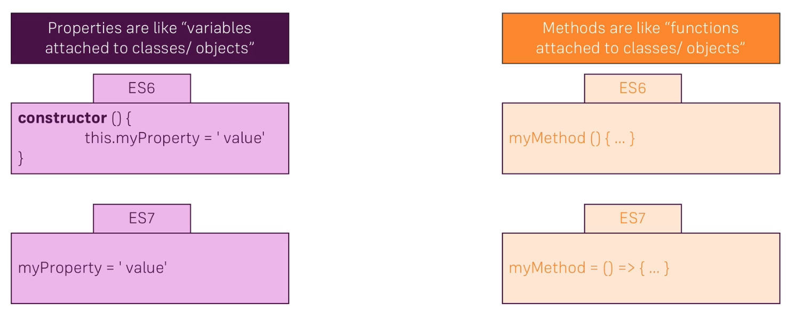
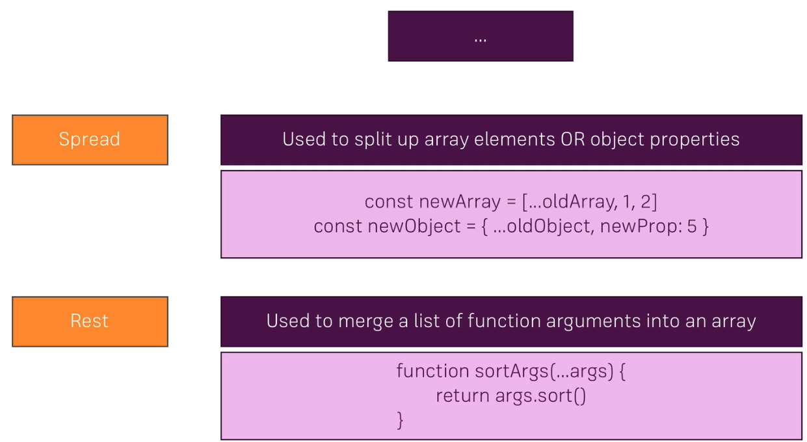
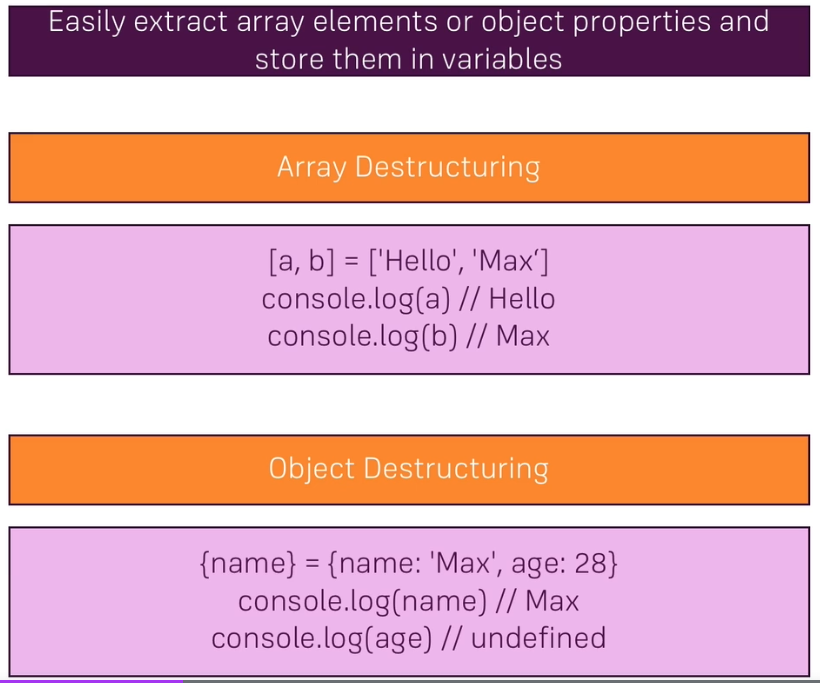

# JavaScript Refresh (ES6 - Next-gen JS) !

Author: Junyoung Park (CRCIV, Insensory)

# Variables

## `let` and `const`

- `let`: For variable values
- `const`: For constant values - preventing the other value stored later !

```JavaScript
    let myNameVar = 'Junyoung';
    console.log(myNameVar);
    myNameVar = 'Oops, I\'m Chulsu';
    console.log(myNameVar);

    const myNameConst = 'Junyoung';
    console.log(myNameConst);
    myNameConst = 'Oops, I\'m Chulsu'; // Error hits here ! (Type 'const' don't allow it.)
    console.log(myNameConst);
```

# Arrow Function

## Declaration

```JavaScript
    function myFnc1(p1, p2){
        return p1 + P2;
    }

    // Storing anonymous function on a variable
    // (params...) => {Function code block}
    const myFnc2 = (p1, p2) => {
        return p1 - P2;
    }

    // Can be used as a general function call.
    let plus = myFnc1(1,2);
    let minus = myFnc2(1,2);

    console.log(`Plus: ${plus}, Minus: ${minus}`)
```

# Import & Export Modules

## Exporting multiple targets

- `A3_utils.js`

```JavaScript
export const v1 = 3;
export const v2 = 5;

function myFnc1(p1, p2) {
return p1 + p2;
}

// Storing anonymous function on a variable
// (params...) => {Function code block}
const myFnc2 = (p1, p2) => {
return p1 - p2;
};

// Export module variables & parameters.
// - Can be used in the other files using `import 'FNC' from 'FILE'` term.
export const plus = myFnc1;
export const minus = myFnc2;
```

- `A3_onlyOne.js`

```JavaScript
// When you're using default option, the name of target is not required.
export default () => {
    console.log("This module has only one function.");
    console.log("- So it can be imported without using {BRACELETS} !");
};
```

- `A3_main.js`

```JavaScript
// import { plus as plusFnc, minus as minusFnc } from "./A3_utils.js";
// or just...
import * as utils from "./A3_utils.js";

import onlyOneFnc from "./A3_onlyOne.js";

console.log(utils.plus(utils.v1, utils.v2));

console.log(utils.minus(utils.v1, utils.v2));

onlyOneFnc();

```

# Classes

## What is class?

- A class have `property` and `method`.
- A class can be extended with the other class using `extend`. (Inheritance)
- A class can be used in the other places

```JS
class Human{
    constructor(_gender){
        this.gender = _gender;
    }
    tellMyGender(){
        console.log(this.gender)
    }
}

class Person extends Human{
    constructor(_name, _gender){
        super(_gender);
        this.name = _name;
    }
    tellMyName(){
        console.log(this.name)
    }
}

const person = new Person('Junyoung', 'Male');

person.tellMyName();
person.tellMyGender();
```

## Properties & Methods

### 1. Difference between ES6 and ES7



### 2. Example Code

```js
class Human {
  gender = _gender;
  tellMyGender = () => {
    console.log(this.gender);
  };
}

class Person extends Human {
  // Omitting constructor !
  name = _name;
  gender = _gender;
  tellMyName = () => {
    console.log(this.name);
  };
}

const person = new Person("Junyoung", "Male");

person.tellMyName();
person.tellMyGender();
```

# Spread & Rest Operators

## 1. What is '...' operator?



## 2. Example code

```js
// For array
const numbers = [1, 2, 3];
const newNumbers = [...numbers, 4, 5, 6];

console.log(newNumbers);

// For object
const person = {
  name: "Max",
};

const newPerson = {
  ...person,
  age: 29,
};

console.log(newPerson);

// Rest operator

const filter = (...args) => {
  return args.filter((el) => el === 1);
};

console.log(filter(1, 2, 3));
```

# Destructing

## 1. How it works?



## 2. Example Code

```js
// Array Destructing
const numbers = [1, 2, 3];

// In which the element is not required, just add empty space between commas
const [n1, , n3] = numbers; // [1, ,3]

console.log(n1 + n3);

// Object Destructing

const person = {
  name: "Junyoung",
  age: 28,
  gender: "male",
};

// 'name' is just used same key as original object.
// we use 'sex' as new name of the key 'gender' in the original object.
const { name, gender: sex } = person;

console.log(name, sex);
```

# Referencing

```js
const person = {
  name: "Junyoung",
};

const secondPerson = person;

console.log(secondPerson);

person.name = "New Name";

console.log(secondPerson);

// In this code, `secondPerson` is just referencing `person` object.
// So, if we change the properties of `person`, `secondPerson` shows the same changes
person.name = "Junyoung";
// Then, how can we `Deep Copy` the `person` object into new one?

const thirdPerson = {
  ...person,
};
console.log(thirdPerson);

person.name = "First Person";

console.log(person);
console.log(thirdPerson);
```

# Array Mapping

## Example Code

```js
const numbers = [1, 2, 3];

// There are several array functions in ES6 ... (map, filter, sort, findIndex, find ... etc)
const doubleNumArray = numbers.map((num) => {
  return num * 2;
});

console.log(numbers);
console.log(doubleNumArray);
```

## More array functions

- `map()` => https://developer.mozilla.org/en-US/docs/Web/JavaScript/Reference/Global_Objects/Array/map

- `find()` => https://developer.mozilla.org/en-US/docs/Web/JavaScript/Reference/Global_Objects/Array/find

- `findIndex()` => https://developer.mozilla.org/en-US/docs/Web/JavaScript/Reference/Global_Objects/Array/findIndex

- `filter()` => https://developer.mozilla.org/en-US/docs/Web/JavaScript/Reference/Global_Objects/Array/filter

- `reduce()` => https://developer.mozilla.org/en-US/docs/Web/JavaScript/Reference/Global_Objects/Array/Reduce?v=b

- `concat()` => https://developer.mozilla.org/en-US/docs/Web/JavaScript/Reference/Global_Objects/Array/concat?v=b

- `slice()` => https://developer.mozilla.org/en-US/docs/Web/JavaScript/Reference/Global_Objects/Array/slice

- `splice()` => https://developer.mozilla.org/en-US/docs/Web/JavaScript/Reference/Global_Objects/Array/splice
