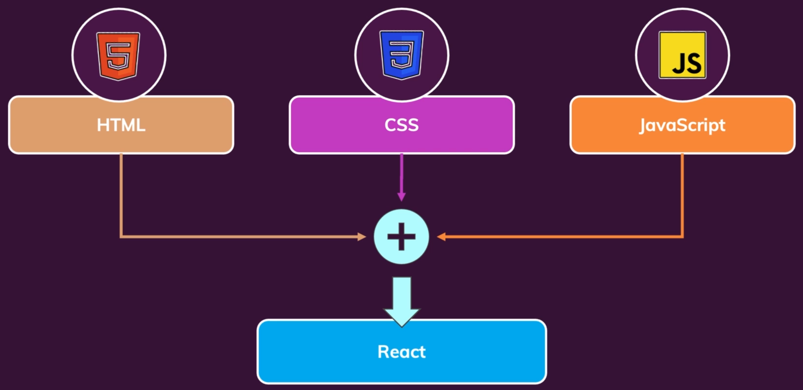

# Introduction to React

- What we do in this section?

  - Working with components
  - Working with data

- Component : A unified thing made of HTML, CSS and Javascript !
  

  - In react ... Split big chunks of code into multiple smaller functions !

  - **Implemented in `Declarative Approach`!**
    - We only need to focus on **Actual State** of components

# Installing React Project

```sh
npx create-react-app your-app-name
cd your-app-name
npm start
```

# Standard React Project

## Procedure

- `index.js` is firstly executed

# User-created Components

- Component is just a function that returns HTML code in JSX !
- The name of component should be start with a capital letter for each words.
  - e.g.) MyItem, StartButton ...

## Example Code

1. `ExpenseItem.js`

```js
function ExpenseItem() {
  return <h2>Expense Item !</h2>;
}

export default ExpenseItem;
```

2. `App.js`

```js
import ExpenseItem from "./components/ExpenseItem";

function App() {
  // Imparative Approach (Standard JS)
  // const para = document.createElement("p");
  // para.textContent = "Imparative Element Append";
  // document.getElementById("root").append(para);

  // Declarative Approach
  return (
    <div>
      <h2>Let's get started!</h2>
      <p> Declarative Element</p>
      <ExpenseItem></ExpenseItem>
    </div>
  );
}

export default App;
```

# Rules for Component Declariation

- The component can **only contain a single root**

```js
// function ExpenseItem() {
//   return;
//     <div>Date</div>
//     <div>
//       <h2>Title</h2>
//     </div>
//     <div>Amount</div>
// } // Not allowed, the component can only contain a single root

function ExpenseItem() {
  return (
    <div>
      <div>Date.toISOString</div>
      <div>
        <h2>Ferrari F50</h2>
      </div>
      <div>$39800.00</div>
    </div>
  );
} // // Allowed, It contains only one root, the <div> element.

export default ExpenseItem;
```

# Adding basic CSS styles

- Import CSS code to the component code.
- Using `className = ...` attribute in JSX elements.

# Using dynamic data and expressions.

- You can put your own variable on JSX with closing bracelets `{variable}`

```js
import "./ExpenseItem.css";

function ExpenseItem() {
  const expenseDate = new Date(2023, 1, 10);
  const expenseTitle = "Ferrari F50";
  const expenseAmount = 398.0;
  return (
    <div className="expense-item">
      <div> {expenseDate.toISOString()} </div>
      <div className="expense-item__description">
        <h2> {expenseTitle} </h2>
        <div className="expense-item__price"> {expenseAmount}</div>
      </div>
    </div>
  );
} // // Allowed, It contains only one root, the <div> element.

export default ExpenseItem;
```

# Reusing React Components

- Components are can be used multiple times as functions and their parameters !
  - Using `Parameters` or `Props`

## Props(Properties) method


- Send `Parameters` as `Properties` of the component
  - `<YOUR_COMPONENT PROP_1=VALUE_1 PROP_2=VALUE_2 ...></YOUR_COMPONENT>`
- And use them using `props` parameters in your component.
  - `props.PROP_1, props.PROP_2 ...`

## Example Code

- `App.js`

```js
function App() {
  const expenses = [
    { title: "Lamborghini", amount: 666.66, date: new Date(2023, 1, 10) },
    { title: "Poresche", amount: 123.55, date: new Date(2021, 1, 10) },
    { title: "Audi", amount: 999.66, date: new Date(2022, 6, 9) },
  ];

  return (
    <div>
      <h2>Let's get started!</h2>
      <ExpenseItem
        title={expenses[0].title} // Properties as attributes
        amount={expenses[0].amount}
        date={expenses[0].date}
      ></ExpenseItem>
      <ExpenseItem
        title={expenses[1].title}
        amount={expenses[1].amount}
        date={expenses[1].date}
      ></ExpenseItem>
      <ExpenseItem
        title={expenses[2].title}
        amount={expenses[2].amount}
        date={expenses[2].date}
      ></ExpenseItem>
    </div>
  );
}
```

- `ExpenseItem.js`

```js
import "./ExpenseItem.css";

function ExpenseItem(props) {
  // Properties in this `props` object parameter
  const expenseDate = props.date;
  const expenseTitle = props.title;
  const expenseAmount = props.amount;
  return (
    <div className="expense-item">
      <div> {expenseDate.toISOString()} </div>
      <div className="expense-item__description">
        <h2> {expenseTitle} </h2>
        <div className="expense-item__price"> ${expenseAmount}</div>
      </div>
    </div>
  );
}

export default ExpenseItem;
```

## Additional !

```js
import "./ExpenseItem.css";

function ExpenseItem(props) {
  const expenseTitle = props.title;
  const expenseAmount = props.amount;
  const dateString = {
    year: props.date.getFullYear() + "년",
    month: props.date.toLocaleString("ko-KR", { month: "long" }),
    day: props.date.toLocaleString("ko-KR", { day: "2-digit" }),
  };
  return (
    <div className="expense-item">
      <div>
        <div>{dateString.year}</div>
        <div>{dateString.month}</div>
        <div>{dateString.day}</div>
      </div>
      <div className="expense-item__description">
        <h2> {expenseTitle} </h2>
        <div className="expense-item__price"> ${expenseAmount}</div>
      </div>
    </div>
  );
}

export default ExpenseItem;
```

# Splitting Components

- A single components seems getting bigger ...
  - We need to split them into smaller ones

## `ExpenseDate.css`

```css
.expense-date {
  background-color: rgb(116, 34, 14);
  padding: 10px 20px;
  text-align: center;
  border-radius: 10px;
  border: 3px solid white;
  color: white;
}

span {
  display: flex;
  justify-content: space-around;
}

.year {
  font-weight: bolder;
  font-size: 15pt;
}

.day {
  color: aquamarine;
  font-weight: bolder;
  background-color: blueviolet;
}
```

## `ExpenseDate.js`

```js
import "./ExpenseDate.css";

function ExpenseDate(props) {
  const dateString = {
    year: props.date.getFullYear() + "년",
    month: props.date.toLocaleString("ko-KR", { month: "long" }),
    day: props.date.toLocaleString("ko-KR", { day: "2-digit" }),
  };
  return (
    <div className="expense-date">
      <div className="year">{dateString.year}</div>
      <span>
        <div className="month">{dateString.month}</div>
        <div className="day">{dateString.day}</div>
      </span>
    </div>
  );
}

export default ExpenseDate;
```

## `ExpenseItem.js`

```js
import ExpenseDate from "./ExpenseDate";
import "./ExpenseItem.css";

function ExpenseItem(props) {
  const expenseTitle = props.title;
  const expenseAmount = props.amount;

  return (
    <div className="expense-item">
      <ExpenseDate date={props.date}></ExpenseDate>
      <div className="expense-item__description">
        <h2> {expenseTitle} </h2>
        <div className="expense-item__price"> ${expenseAmount}</div>
      </div>
    </div>
  );
}

export default ExpenseItem;
```

# Wrapper Component

## Inside `Card.js`

- Add components inside `Card`, with the special component `props.children`.
- To adapt styling(css) of their own components, append their class name using `props.className`.
- By this way, the components wrapped by `Card`, shares its attributes.

```js
import "./Card.css";

function Card(props) {
  // Wrapper Component
  const classes = "card " + props.className;
  return <div className={classes}>{props.children}</div>;
}

export default Card;
```

## Used in `Express.js`

- `Wrapper Component` can be used as below, to wrap the other components.

```js
<Card className="expense-item">
  <ExpenseDate date={props.date}></ExpenseDate>
  <div className="expense-item__description">
    <h2> {expenseTitle} </h2>
    <div className="expense-item__price"> ${expenseAmount}</div>
  </div>
</Card>
```
